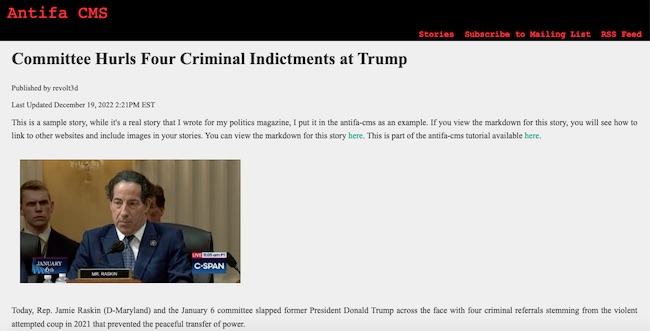

DRAFT December 27, 2022 THIS IS NOT COMPLETE YET, BUT IT'S GETTING THERE

These are instructions to build a website using existing off-the-shelf software and no programming skills. This recipe builds out more than merely a website. In the end, you will have a complete content management and publishing system.

This project is called antifa-cms. While it's certainly possible for a fascist to use this application and documentation, it's frowned upon. On the other hand, you don't need to be out in the streets punching Nazis in the face to be anti-fascist. I'm sure the vast majority of people are anti-fascist (antifa). 

It doesn't matter though, all are welcome here. This is a safe space.

- [About Me](#about-me)
- [Getting Started](#getting-started)
- [Level 0](#level-0)
  - [Level 0: Requirements](#level-0-requirements)
  - [Level 0: Your Computer Setup](#level-0-your-computer-setup)
  - [Level 0: Create The Webserver](#level-0-create-the-webserver)
  - [Level 0: Login to Amazon AWS](#level-0-login-to-amazon-aws)
  - [Level 0: Create an Amazon EC2](#level-0-create-an-amazon-ec2)
  - [Level 0: Configure the EC2 to be a Webserver](#level-0-configure-the-ec2-to-be-a-webserver)
  - [Level 0: Install antifa-cms](#level-0-install-antifa-cms)
  - [Level 0: Create your own Content](#level-0-create-your-own-content)
  - [Level 0: Setup auto-publish](#level-0-setup-auto-publish)
  - [Level 0: Point your domain](#level-0-point-your-domain)
  - [Level 0: SSL Certificate](#level-0-ssl-certificate)
- [Design Your Website](#design-your-website)
- [Level 1](#level-1)
- [Vocabulary](#vocabulary)
  - [Apache Webserver](#apache-webserver)
  - [Amazon AWS](#amazon-aws)
  - [Computer](#computer)
  - [Content Management System](#content-management-system)
  - [Docker](#docker)
  - [Github](#github)
    - [Can I use a free GitHub.com account?](#can-i-use-a-free-githubcom-account)
  - [Markdown](#markdown)
  - [Linux](#linux)
  - [PHP](#php)
  - [Symlink](#symlink)
  - [Theme](#theme)
  - [Twig](#twig)


# About Me

I'm a software engineer. I've been building web applications and websites for more than 20 years. I'm old as hell. Over the years, I've learned a few things. One of those things I've learned is how to build a really simple website, requiring essentially no programming skills whatsoever, extremely efficient, cost-effective and fast.

I'm sharing this knowledge with people because creating a simple website is really really expensive. And figuring out how to write code is really time-consuming. With these instructions, you will be able to create a legit website in a few days of tinkering. If you know what you're doing, you can set all of this up in a matter of a couple of hours. 

# Getting Started

I will be the first to admit that this recipe is not the only way to accomplish what I'm describing here. All I'm saying is this how I do it, and it works really well.

The goal of this process is to create a robust content management system to support a public website with no programming required and extremely low hosting costs.

To make all of this cost-effective, and low-tech, we're going to use a bunch of off-the-shelf tools to make it all work for us. We're going to use GitHub.com as our content management tool. We're going to use a super-fast content management system written in PHP called Pico CMS. And we're going to use a simple Linux server and Apache webserver to glue it all together. That last part is a bit technical, but it's not hard to pull off.

# Level 0
Level 0 is the part of the tutorial that is the easiest for non-technical people to consume. In Level 0, I do everything via GitHub.com in terms of managing content - adding stories, editing stories, or whatever you choose to publish.

Level 0 still requires that I setup a public server to run my website. For antifa-cms, that's not a huge lift, but for a non-technical person, it will be the most difficult  part to accomplish. One caveat is that you don't have to use an Amazon EC2 to run antifa-cms. The only requirements are that wherever you run antifa-cms, the server needs to support PHP, and you need some way to connect to it either via SSH or at least have some access to the server's crontab. I recommend going through this tutorial using an Amazon EC2, if you want to switch later, it will be easy for you to figure out how to make it work. 

Eventually I will add what I'm calling Level 1 antifa-cms. This is where you setup everything locally on your laptop or desktop and can make changes to your website locally before you push to your public server. This allows gives you more control over developing changes for your website. This pattern matches what professional engineers would do to maintain your website. I didn't start with this level of tutorial because it is technically and practically not necessary.

## Level 0: Requirements

1. GitHub.com account
2. An Amazon AWS account
3. A laptop or desktop computer that has an SSH client installed

## Level 0: Your Computer Setup

In Level 0, the only thing you need to be able to do is SSH to your Amazon EC2 and a web browser.

On your laptop or desktop, open a terminal and type the following command

```
ssh -V
```

If that command shows an error, you need to install SSH. How do you install SSH on a Mac? I have no idea, it should be installed, if it's not, you either have a really, really old Mac or removed SSH for some reason. Linux users should know how to install SSH. Windows users will need to figure it out.

## Level 0: Create The Webserver

Creating an Amazon EC2 is easy. It's a couple of clicks. But making it work entirely as a web server will require a bit of work. 

We're going to create a tiny EC2 that for most of you will fall into the free tier. If your website gets famous, you might have to pay Amazon some money. For context, I run a webserver with 4 websites on it and it costs me $20 a month. The traffic isn't high, but a tiny website could end up costing like $2 a month. 

1. Login to [aws.amazon.com](https://aws.amazon.com/). If you don't have an account, you need to create one.
2. Create an EC2.
3. Point your domain name at your newly created EC2
4. Configure SSL
5. Install antifa-cms
6. Create your own content
7. Setup Auto-publish

## Level 0: Login to Amazon AWS

This step is pretty easy, if you don't already have an Amazon AWS account, you need to create one. [aws.amazon.com](https://aws.amazon.com).

Once you've created your and verified that you can login to Amazon AWS, continue to the next step.

## Level 0: Create an Amazon EC2

You have an AWS account and you're logged in as the Root user, not an IAM user.

Click "Services" and select "Compute."


After you click "Compute" a sub-menu should display with an "EC2" option, click that.


There's guarantee you will see what I see when I click on the EC2 option, but you should see something on your screen that says "Launch Instance" - click that. By "instance," they mean an EC2.


Now you need to name your instance. It really doesn't matter what you name it, but it should probably make sense based on what we're setting up. If your website is about butterflies, you name it "My Butterfly Webserver."


The next section is selecting the operating system your EC2 will use. You need to select Ubuntu. It doesn't matter if the version you select doesn't match what's in the below screenshot, whatever is the most current version will work.


The rest of the options for creating an EC2 can be the default values.

The t2.micro is fine for the type of EC2. 

You do need to create an SSH key pair for logging into your new EC2 instance. We're going to connect using SSH, and this is required to make that work.


You can leave all of the defaults as they are when creating a key pair, you do need to provide a name. The name doesn't really matter, you can name it something like "My Keys."


Under Network Settings, all of the defaults will work, but check the boxes for allowing HTTPS and HTTP. 


Everything else can be the defaults. For storage, you can crank it up to 30GB and still fall into the free tier, but honestly 8GB is probably fine.

Click "Launch Instance."

It will take a few minutes to create the new EC2 instance. If you click on "Instances" in the left side navigation in the AWS dashboard, you should see your new instance. The Status Check will take a few minutes to show green, but the instance should get built fairly quickly. 

Before we move on, let's verify that you can SSH into that new EC2. 

Click "Instances," check the checkbox for your new EC2 and click the "Connect" button. This won't actually connect you, but it will show you how to connect to your new EC2 instance.

Assuming that you have the private key from when you launched your instance, and you have that pem file saved on your laptop or desktop, the "Example" command should work.

For my instance, I created a pem called 12300.pem. It doesn't mean anything - the 12300 - it's just a number I made up. I have that file 12300.pem stored in on my laptop in ~/.ssh.

So when I want to connect to one of my EC2, I could do something like this.

```
ssh -i "~/.ssh/12300.pem" ubuntu@ec2-33-321-211-321.compute-1.amazonaws.com
```

If you did everything right, and I explained everything correctly, you should just login with a command similar to that ssh command. You shouldn't be prompted for a password, the key pair is the authentication method.

If this didn't work, you need to go back to your key pair and make sure that's correct. You can delete and create key pairs. You can throw the EC2 you created in the trash and start over. I do that all the time. 

To trash an EC2, first change it's state to stopped, and then terminate it. Even after we build an EC2 and set all of it, there is nothing on the EC2 that we care about. All of our code and content is managed via GitHub.com. So if the server dies unexpectedly, yes, the website will be down, but no data will be lost. 

That's one of the great things about this setup for a website is that the actual webserver is disposable. And you really don't need to use Amazon AWS. You can literally run this on any webserver that can serve up PHP. So don't lock yourself in to Amazon because I happened to use it in this tutorial. I use AWS because I'm familiar with it. I personally hate Google and will never use Google Compute, but there are many options out there better than Amazon.

## Level 0: Configure the EC2 to be a Webserver

By default a new EC2 doesn't do jack. It's just a barebones server that you can connect to via SSH. Do that, connect via SSH and run the following commands.

The first thing you need to do is become root. The root user can do anything, particularly install and upgrade system packages, which is what we're going to do.

```
sudo su -
```

Whenever I setup a new instance, I make sure all of the packages on the box are up-to-date. To do that run the following command.

```
apt-get update;apt-get upgrade;
```

If you get asked any questions, just accept the default unless you know that doing so would be dumb.

When the updates are done, and that shouldn't take long on a new EC2, install PHP.

```
apt-get install php php-mbstring php-dom
```

Doing so will also install a bunch of other stuff like the Apache webserver, we want those things. So type 'y' when you are asked to continue.

```
Do you want to continue? [Y/n] y
```

Now let's do some tweaking to our Apache webserver.

Our cms needs to have an Apache module activated called mod_rewrite. The module is already on your server, it just needs to be activated. To activate mod_rewrite, create a symlink with the below command as root (sudo su -)

```
ln -s /etc/apache2/mods-available/rewrite.log /etc/apache2/mods-enabled
```

Now restart Apache and you should be good to go. We're not done setting up the web server, but it should be working with a non-https browser call after the restart.

```
/etc/init.d/apache2 restart
```

To test that the webserver is working, find your public IP address by looking at your instance details in the AWS dashboard. I'm specifically not telling you precisely how to find this information in the AWS dashboard because you need to be comfortable navigating the dashboard. 

If your public IP address is 43.031.301.90, in your web browser go to

```
http://43.031.301.90
```

Note that this time, you don't want to use https. Your browser force you to use https, but it worn't work, yet. Right now, SSL is not configured on your server, so https will fail. 

If your webserver is working, you should see something like this.


If it's not working, you need to figure that out.

Some things to check.

1. Is the EC2 running and can you SSH into it?
2. If you can SSH, run 'sudo su -' followed by 'ps aux | grep apache' You should see apache processes running.


If you don't see any apache2 processes running, you need to start apache. To do that, run this command as root (that's the 'sudo su -' command).

```
/etc/init.d/apache2 start
```

You can also run stop and restart apache whenever you need to.

```
/etc/init.d/apache2 stop
```

```
/etc/init.d/apache2 restart
```

If you still can't see the default apache webpage, and everything seems to be running, I don't have any more tips. You need to search for solutions on your own, using Stackoverflow or something.

## Level 0: Install antifa-cms
Because of how Git works, let's create a fork of the antifa-cms. The reason for forking, rather than just cloning the repo, is that we want to do our own commits to our forked repo. If we don't fork antifa-cms, we would be pushing our content and theme changes to that repo, which wouldn't work. I would reject those change requests as inappropriate.

I want you to fork the antifa-cms repo, creating your own copy of antifa-cms that you manage yourself. If I make changes to the main antifa-cms, you can update your fork whenever you choose to do so, but that's all down the road.

Login in to GitHub.com and fork [antifa-cms](https://github.com/revolt3d/antifa-cms).

Look for the Fork button in the upper right of the repo page.

Here's what the fork screen looks like. 


Accept all of the defaults, but you should name the forked repo something that relates to what you're actually doing with your website. For instance, if your website is about Antifascist Political Philosophy, call the repo 'antifa-poli-sci' or something like that. If it's about the migratory patterns of monarch butterflies, you call name is 'monarch-butt'. 

It really doesn't matter what you name the forked repo, but it needs to make sense to you, and if you're going to collaborate with others, it needs to make sense to them.

I'm going to assume all of the forking went as planned and now you're staring at your new forked repo. 

You need to put that forked repo on your new EC2, and you're going to do that with git. Git is different than GitHub.com. GitHub.com is built on top of git. The real genius is in git, GitHub.com is just convenient. Technically, you can do all of this without GitHub.com, but I want to leverage GitHub.com as the user interface to our cms to publish new content, or change and delete existing content.

To install the forked antifa-cms repo on our new EC2 server, we first need to SSH into the EC2 instance and 'sudo su -' to become root.

This part could get a little technical, so take it slow.

As an overview for what we're about to do is that we're going to configure our Apache webserver to run our forked antifa-cms code, instead of that default Apache web page we saw earlier. To do this, we're going to run a few commands from the command-line on our EC2 as root.

Just delete the entire html directory, we don't need it.

```
cd /var/www; rm -rf html;
```

Now clone our forked antifa-cms into the /var/www/ directory. The clone command will look something like this. You will need to adjust it for your repo name.

```
git clone https://github.com/hack3r3d/test-cms.git
```

I recommend using the https GitHub.com URL. There's an SSH one too, but this will suffice for what we're doing, which is only pulling from GitHub.com to the server. We won't be editng files on the server and pushing them to the repo - it's one-directional.

To find the https URL for your repo, click the "Code" button.


Now back to the server and our SSH client as the root user our freshly cloned repo.

We removed the default html directory and created a new directory under /var/www for our cms. We need to configure Apache to know about our new cms code, and use it instead of the now-deleted html directory.

We're going to use an application called vi. This is an editor you should become familiar with, if you haven't already. 

Open the Apache server configuration file.

```
vi /etc/apache2/sites-enabled/000-default.conf
```

Move the cursor to the line: DocumentRoot /var/www/html and place the cursor on the 'h' in html.

Remove the html part by pressing 'x.' Once html is removed, press the 'i' key and type the directory where you cloned the cms repo. In our example, that would be test-cms.

Still editing the sites-enabled/000-default.conf Apache config, add this inside the VirtualHost section port 80. We're still in unecrypted world.

```
<Directory /var/www/test-cms>
  AllowOverride All
</Directory>
```

Once you've change the DocumentRoot to the correct directory location, save the document in vi. To do that, press ESC once, type a colon ":" followed by the letters "wq" and press enter. 

If you find vi to be frustration, some people like pico instead. To open your Apache config using pico, run this command. Pico is more user-friendly, but I just prefer vi.

```
pico /etc/apache2/sites-enabled/000-default.conf
```

Save your config changes and restart apache. 

```
/etc/init.d/apache2 restart
```

For this next step, we are going to need composer installed. Composer is a package manager for PHP packages. What that means is that it allows us to install PHP packages that our underlying Pico CMS needs to function.

```
apt-get install composer
```

That should install composer and all of its dependencies.

Before we move on, let's tweak some permissions on our server. It doesn't make sense to keep all of the antifa-cms files and directories owned by the root user, which has been the case up until now. Logging into the box, we login as the "ubuntu" user. Let's change the ownership of all of the files and directories in our forked antifa-cms. This will give our user access to files and directories so we don't to become root to perform our tasks going forward.

Run the following command, but change the path to where you installed your forked antifa-cms.

```
chown -R ubuntu.ubuntu /var/www/test-cms
```

Now run the following exit command, to return your login to the "ubuntu" user and no longer be root. It's safer this way, and it makes life easier to just be a normal user. We needed to be root to get Apache and everything working correctly.

```
exit
```

Using my test-cms example, change directories to your forked antifa-cms directory.

```
cd /var/www/test-cms
```

Now run the composer to setup the antifa-cms system. Doing this will install all of the necessary PHP packages that the underlying Pico CMS needs to operate.

```
composer update
```

``` 
/etc/init.d/apache2 restart
```

Now if you reload the webpage you had pointing to your EC2 public IP address, you should see the default antifa-cms home page.

```
http://43.31.301.90
```


## Level 0: Create your own Content

Let's keep going. Now create a new story to publish on your new antifa-cms webserver. Don't worry about what it looks like, let's just push a story to your server. 

We're going to create the content in GitHub.com, and when it's ready, we're going to pull the new content down to the EC2 instance cloned repo.

Sign into GitHub.com and view your forked antifa-cms repo. Click on the content directory. This where all of your content will live as markdown text files. 

Now click on the story directory located in the content directory. In my sample cms, I put all of my stories in this story sub-directory. Doing so makes it easy for me to distinction between a "story" and maybe just a webpage, like the homepage for the antifa-crm. To see the homepage markdown, before you click into the story directory, open the file named index.md.

When you first view the index.md, or any markdown in GitHub, GitHub doesn't show you the markdown, it tries to parse the markdown. You want to see the markdown, so click the button to "Display the source blob."


This will let you see what the actual markdown looks like for the antifa-cms default homepage. 

It should look like this.


The top section of the document is required for all content. 

```
---
Title: antifa-cms Home Page Example
Description: 
Author: Editor
Date: 2021-12-15 10:31:03
Template: index
---
```

Title comes through in the HTML as an H1.

Description comes through as an H2, if it's set, it's optional.

Author shows up as the byline for the story.

Date is the date the story was published, it could be updated when the story is changed.

Template is key, this what tells the CMS which template to use to rend this page. The 'index' template is the most basic template. It's perfect for homepages, or about us pages, content that is pretty static. In your implementation, this could be totally different.

Now let's create our own story in the content/story directory. In GitHub.com, you should be looking at the story directory in GitHub.com, and it should look like this.


Now click on that "Add File" button, and select the "Create new file" option.

For simplicity, let's call the new file "firststory.md". 

First thing you need to do is add the story meta data mentioned above.

```
---
Title: My First Story
Description: It feels so good to get things done.
Author: Penny Lane
Date: 2021-12-22 10:31:03
Template: story
---
```

Note that I chose the "story" template instead of index. The story template includes the byline for the author and the publish date (see above Date field in the story meta data)

Now let's add our unique content to this story.

```
---
Title: My First Story
Description: It feels so good to get things done.
Author: Penny Lane
Date: 2021-12-22 10:31:03
Template: story
---


That above line is how you include an image.

This antifa-cms is bad ass. It's so easy to get running and it's efficient with cloud computing resources to save money.

You can learn more about antifa-cms, but visiting our GitHub.com repo [antifa-cms](https://github.com/revolt3d/antifa-cms)

```

Once you have the markdown set, it's time to publish your new story on your EC2.

To do that, you're going to SSH to the EC2 and pull down the changes from GitHub.com.

So SSH to your EC2 like you've been doing all along and run the following command, adjusting it to meet your needs.

```
cd /var/www/test-cms
git pull
composer update
```

The "git pull" got the latest code changes. The "composer update" does something with the underlying Pico CMS codebase, but it's wise to run composer update after you pull code from your git repo.

If you created markdown named "firststory.md," the URL to your new story is http://43.31.301.90/story/firststory. If your IP address is not 43.31.301.90, change that to whatever your public IP address for your new EC2.

## Level 0: Setup auto-publish

While it's fun to login to a server and run the above commands to publish your new or update website content, it shouldn't be required. 

There are a million different ways to solve this problem, and here's a super low-budget way.

On Linux, which is what your server is running, there's a tool called cron. Cron let's us schedule things - executing commands. What we're going to do, to avoid having to login to the server every time we publish content is we're going to setup a cron job to run on an interval to pull down any changes.

I'm the first to admit that this solution is a bit goofy. It would be more efficient to have GitHub.com inform the server that there are changes when they happen, rather than constantly polling GitHub to see if there are changes.

Login to your server. You don't need to be root. We're going to edit the ubuntu user's crontab.

```
crontab -e
```

Add a line to the crontab that looks like this.

```
*/10 * * * * cd /var/www/test-cms;git pull;composer update;
```

This means that every 10 minutes every day of the week of every month, run that command, which is really three commands. Those are the same commands you ran previously, all just stuck on one line.

Save that crontab, and you're all set to auto-publish changes that are committed to the main branch in GitHub.com. The branch is a key point to note. Only changes in the main branch will be deployed to the server. That means that you can create different branches in GitHub.com to work on content, or presentation, but those changes won't deploy to production until the changes are merged to the main branch. To leverage the full power of branching, you need to be able to run your website on your laptop or desktop. That's what the Level 1 training covers.

## Level 0: Point your domain

Technically you don't have to do this, you could just access your website with the random Amazon AWS domain, but I'm assuming that we're building a real website here.

## Level 0: SSL Certificate

For this tutorial, I'm going to use a free SSL certificate from Let's Encrypt. Unless you plan on going big time big with your website, the Let's Encrypt free cert might be good enough. There are rate limits on these certs.

If you want to purchase your own cert, I purchase SSL certificates from this company called ssls.com. A cheap cert can be as little like $4 a year. These are low assurance certificates, which means they will encrypt data, but the end user doesn't have a ton of confidence in the webserver running that cert or you. 

Honestly, most people aren't going to care which SSL cert you use. However, if you skip the SSL cert and just run your website unencrypted, you will get penalized by search engines and many browsers will flag your website is potentially dangerous, and not in a good way.

# Design Your Website

I can't help you design your website. You can see by my example website, and by looking at my public websites that I don't know anything about web design. I'm an engineer. 

However, with antifa-cms, you don't need to run a hideous website. At the end of the day, we're talking about html, some images and css. 

All of the presentation - the UI - is located in the themes directory. The default theme is antifa-cms-theme. You're more than welcome to use that theme, but it's basic af.

With antifa-cms, you are only limited by your own imagination and skills. Build your own theme, and make your website look like your own creation. My stuff my be hideous, but it does reflect my personality - simple and functional.



One of the real benefits of antifa-cms, and the underlying Pico CMS application is that you can make a truly unique website. If you've ever made a Wordpress website, you know that to make it look like it's not another Wordpress site, you have to put a lot of work into it.

If you want to spend some time learning how to buid Pico CMS themes, check out the community themes that are available for free. Try to find one that looks sort of like what you want and then tweak it to make it your own.

If you are going to get into designing your own themes and plugins, you need the Level 1 training. That gets you setup with your website running on your laptop or desktop. That allows you to hammer away at the code and no one needs to know about it. Once you get something that's cool, push it to GitHub and let's see it.

# Level 1

THIS SECTION ISN'T COMPLETE. IT'S JUST NOTES AT THIS POINT -- DEC. 29, 2022

This is not yet written. It's not necessarily necessary, but setting up your website to run your local laptop or desktop is vastly better than ddoing everything via GitHub.com. That's my opinion. As an engineer, setting everything up locally is the first step. After I got everything working locally, I would setup my production webserver and deploy it.

The reason I didn't start here for antifa-cms is because you don't need to run your website locally. You literally can do everything via GitHub.com. Since I'm trying to reach people who are not super technical, it made sense to me to start with the GitHub.com approach. 

The instruction won't be terribly difficult. It's mostly setting up Docker on your local computer and running a couple of commands.

# Vocabulary

This guide is meant for everyone, particularly non-technical people who need a low cost website. Below are some definitions to help those who need the help.

## Apache Webserver

Apache is an open source webserver that has been around for decades. It's not the only webserver you could use to run antifa-cms. I chose Apache for this tutorial because it's the webserver I'm move familiar. Any webserver that can parse PHP could work for this, but simplicity, let's stick with Apache for now.

## Amazon AWS

In this tutorial, we're going to use Amazon AWS. There are other providers of such services, but AWS is the most familiar to me. I've used Google Compute before, and it works, but I loathe Google as a company. Amazon isn't much better, but it's fine for our purposes. All of these instructions, besides setting AWS infrastructure should be the same.

## Computer

You will need a computer to build your content management system. This is where the bulk of the work is done. The computer you use should be running Mac or Linux. I'm certain these instructions would work with Windows, but I haven't used Windows in many, many years.

## Content Management System

A content management system does what it sounds like it would do - a system that manages content. In this context, content is a web page. Content could also include images that are diplayed on the web page. A content management system makes managing the web pages (e.g. content) easier.

That's what we're building here - a content management system with publishing capabilities.

## Docker

Docker is this amazing tool that you run on your computer that let's you spin up virtual servers on your computer. These little servers run pretty much like a real server will operated. We will use Docker for testing and publishing content.

This part of the process does potentially get technical, if something doesn't work correctly.

## Github
For this recipe you need a GitHub.com account. 

### Can I use a free GitHub.com account?

The short answer is, and the long answer is maybe. It comes down to whether you want a private repository for your website code and content, or is a public repo OK? Without a paid subscription to GitHub.com, all of your code repositories are public. What that means is that anyone on GitHub.com can see your code repository. They can even propose changes to your repository, but you can just reject them if the changes aren't useful. For all intents and purposes, no one is likely to care about your GitHub.com repository. If it matters to you that your website code not be in a public repository, then pay GitHub.com $4 a month for a professional account and create a private repo.

## Markdown

Markdown is a simple document formatting standard. It is what this file you are reading is written. You can learn more about Markdown [here](https://www.markdownguide.org/cheat-sheet/). What's great about using markdown to build new web pages - to add more content - is that it completely separates the presentation from the content. In Markdown we can structure our story content to be positioned or appear a certain way, but how that will actually be made to look like it's supposed is handled by the theme. So if you want to find where the HTML is for antifa-cms, it's in the themes/antifa-cms-theme directory. Everyone is encouraged to create their own themes, or use one of the already built Pico CMS themes found [here](https://picocms.org/themes/). Because antifa-cms is based on Pico CMS, any of those themes should work fine.

## Linux

Linux is an open source operating system. In terms of running websites - most web servers are running some version of Linux.

## PHP

PHP is a web scripting language. It runs on the webserver. It parses PHP scripts and generates HTML for a user's browser. In this context, PHP is parsing Markdown that we write to render HTML web pages.

## Symlink

Symlinks are links created for a particular file or directory. So rather than copying a file from one directory to another, you can create a symlink. That symlink works pretty much the same as the file it is linking to. Any changes to the source file would be automatically reflected in the symlink.

The command to symlink on Linux is called "ln".

## Theme

The theme in antifa-cms is where the design of the website is implemented. This where the HTML and the CSS files are located. Poke around at the very simle antifa-cms-theme, and check out the available Pico CMS [themes](https://picocms.org/themes/). Pico CMS has some minimal documentation about themes [here](https://picocms.org/docs/#themes). 

## Twig

The themes use the Twig templating system. Twig is a really a powerful and major templating system. If you decide to build your own theme, or if you want to modify an existing theme, you should know the basics of Twig. Twig lets you do a lot. The Twig documentation is available [here](https://twig.symfony.com/doc/).
